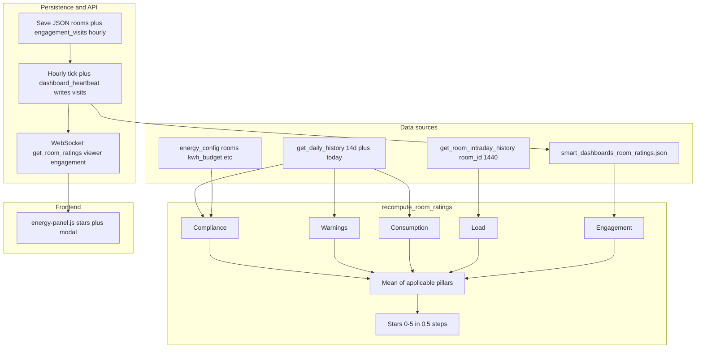
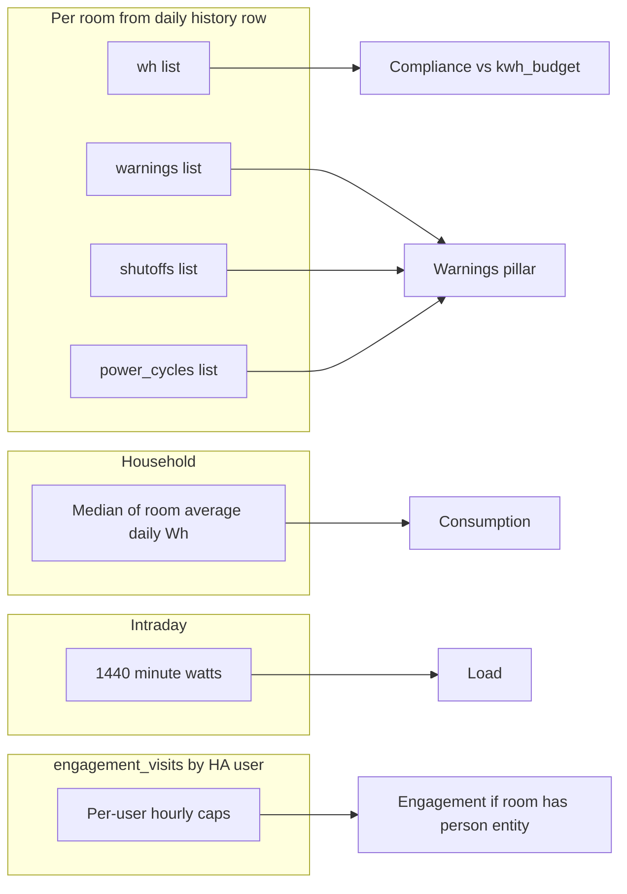

# Room efficiency rating — reference

Purpose: How Smart Dashboards room efficiency scores are computed, where data comes from, and what to edit when tuning behavior.

Related code: `custom_components/smart_dashboards/room_ratings.py`, `websocket.py` (`get_room_ratings`), `__init__.py` (hourly job), `frontend/energy-panel.js` (stars + modal).

This is **not** Home Assistant’s Statistics API. It uses integration daily/intraday history plus `config/data/smart_dashboards_room_ratings.json`.

---

## High-level data flow

---

## Pillar metadata (`pillar_meta`)

Each room in the WebSocket payload includes **`pillar_meta`**: per-pillar strings **`ok`**, **`no_data`**, or (engagement only) **`na`**.

- **`no_data`**: No usable underlying series for that pillar. The numeric field is **0** (not a neutral placeholder).
- **`na`** (engagement only): Room has **no** `presence_person_entity`. Engagement is **0**, excluded from the composite denominator (**mean of four** pillars).

Legacy JSON without `pillar_meta` is fine: the next hourly recompute adds it.

---

## Pillar criteria (formulas)

Each applicable pillar is **0–100**. The **composite** is an **unweighted mean** of pillars that count:

- **Five** pillars when engagement applies (`pillar_meta.engagement` is `ok` or `no_data`).
- **Four** pillars when engagement is **`na`** (room without person entity).

Pillars with **`no_data`** contribute **0** to the sum but **still count** in the denominator (same as “real” zeros).

**Stars:** `round(avg / 100 * 10) / 2`, capped at 5 (half-star steps). See `_stars_from_average` in `room_ratings.py`.

| Pillar | Function | Input data | Logic summary |
|--------|----------|------------|----------------|
| **1 Compliance** | `_score_compliance` | Per-day `wh` list vs room `kwh_budget` | Requires daily `wh` history. If **no** `wh` series for the room: **0** + `no_data`. Else: fraction of days where `used_kwh <= budget_kwh * 1.02`, times 100. |
| **2 Warnings** | `_score_warning` | Lists `warnings`, `shutoffs`, `power_cycles` | If **no** daily row / no `wh` (same block as compliance): **0** + `no_data`. If rows exist: `100 - min(100, total_events * 4)`. |
| **3 Consumption** | `_score_consumption` | Room **average daily Wh** vs **median** of other rooms’ averages | If no usable peer median (`median_peer <= 0`) or missing consumption context: **0** + `no_data`. Else score from ratio `avg_wh / (median_peer * 1.5)` mapped to 0–100. |
| **4 Load** | `_score_load` | `get_room_intraday_history(legacy_room_id, 1440)` → minute `watts[]` | Empty `watts`: **0** + `no_data`. Else: count minutes with `w > 100`; `100 - min(100, (high_minutes / 60) * 8)`. |
| **5 Engagement** | `_score_engagement_for_user` + `_engagement_score_for_mode` | `engagement_visits` in JSON, last **7** days | **No** `presence_person_entity`: **0**, `na`, **excluded** from composite mean. **With** person: **per Home Assistant user** on `get_room_ratings` (WebSocket user key); **hourly** job uses the **mean** of per-user scores over all user keys seen in the window. Max **2** visits per user per clock hour; score rewards up to **12** distinct hours per day (rolling window). Viewer with no activity in window: **0** + `no_data`. |

**Room keys:** Scores are stored under **`canonical_room_id(room)`**. Daily history rows use **`_room_history_row`** (canonical vs **legacy** slug from `legacy_room_id_history`). **Load** uses **`legacy_id`** for intraday history only.

---

## Constants (tweak in `room_ratings.py`)

| Constant | Value | Role |
|----------|-------|------|
| `WINDOW_DAYS` | 14 | Days of daily history for compliance / warnings / consumption inputs |
| `ENGAGEMENT_LOOKBACK_DAYS` | 7 | Days rolled into engagement score |
| Compliance tolerance | `1.02` | `budget_kwh * tol` cap per day |
| Warning penalty | `4` points per event (capped) | See `_score_warning` |
| Load threshold | `100` W per minute | Minutes above this penalize load |
| Load penalty | `8` per “high hour” | `hours_high * 8` subtracted from 100 |

---

## When scores recompute, cache, and how the UI loads them

- **On demand:** WebSocket `smart_dashboards/get_room_ratings` runs `recompute_room_ratings(..., engagement_user_key=<viewer>, persist=False)` in an executor. The response is **viewer-specific** for engagement. It **does not** write JSON and **does not** overwrite `room_ratings_cache` (so the next client still benefits from the hourly household snapshot unless it recomputes too).
- **Scheduled:** `async_track_time_interval` **every hour** in `__init__.py` runs `recompute_room_ratings(..., engagement_user_key=None, persist=True)`, then sets **`room_ratings_cache`** from `ratings_payload_for_ws`. This persists **mean engagement** across HA users and is the shared cache.
- **Engagement input:** `smart_dashboards/dashboard_heartbeat` → `record_dashboard_heartbeat` (max **2** counts per HA user per clock hour) in `engagement_visits`.
- **File:** `config/data/smart_dashboards_room_ratings.json`.
- **Panel:** `_loadRoomRatings()` in `energy-panel.js`; header stars + modal uses **`pillar_meta`** for “No data yet” / “Non applicable”.

---

## Files to edit for common tweaks

| Goal | File |
|------|------|
| Change formulas, windows, neutral defaults | `room_ratings.py` |
| Weight pillars differently (today equal mean of applicable set) | `room_ratings.py` — composite block in `recompute_room_ratings` |
| Recompute frequency | `__init__.py` — hourly interval |
| Modal labels / explanatory copy | `energy-panel.js` — `_openRoomRatingModal` |
| Viewer vs hourly engagement / cache rules | `websocket.py`, `__init__.py` |

---

## Frontend vs backend

Modal and header reflect **`pillar_meta`** for empty pillars and non-applicable engagement. Numeric **0** is intentional when there is no data, not a “neutral” middle score.
