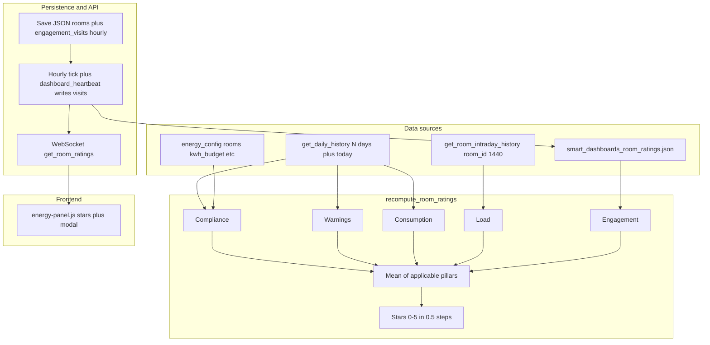
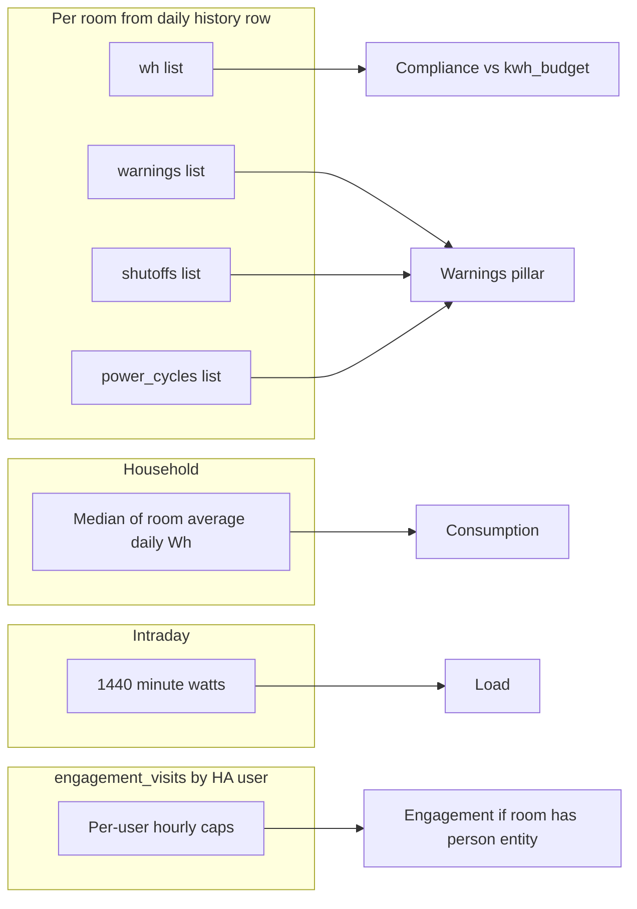

# Room efficiency rating — reference

Purpose: How Smart Dashboards room efficiency scores are computed, where data comes from, and what to edit when tuning behavior.

Related code: `custom_components/smart_dashboards/room_ratings.py`, `efficiency_digest.py`, `websocket.py` (`get_room_ratings`, `save_energy`), `__init__.py` (hourly job + digest schedule), `config_manager.py` / `const.py` (`efficiency_settings`), `frontend/energy-panel.js` (Efficiency settings tab, stars + modal).

This is **not** Home Assistant’s Statistics API. It uses integration daily/intraday history plus `config/data/smart_dashboards_room_ratings.json`.

---

## High-level data flow

---

## Pillar metadata (`pillar_meta`)

Each room in the WebSocket payload includes **`pillar_meta`**: per-pillar strings **`ok`**, **`no_data`**, or (engagement only) **`na`**.

- **`no_data`**: No usable underlying series for that pillar. The numeric field is **0** (not a neutral placeholder).
- **`na`** (engagement only): Room has **no** `presence_person_entity`. Engagement is **0**, excluded from the composite denominator (**mean of four** pillars).

Legacy JSON without `pillar_meta` is fine: the next hourly recompute adds it.

---

## Pillar criteria (formulas)

Each applicable pillar is **0–100**. The **composite** is an **unweighted mean** of pillars that count:

- **Five** pillars when engagement applies (`pillar_meta.engagement` is `ok` or `no_data`).
- **Four** pillars when engagement is **`na`** (room without person entity).

Pillars with **`no_data`** contribute **0** to the sum but **still count** in the denominator (same as “real” zeros).

**Stars:** `round(avg / 100 * 10) / 2`, capped at 5 (half-star steps). See `_stars_from_average` in `room_ratings.py`.

| Pillar | Function | Input data | Logic summary |
|--------|----------|------------|----------------|
| **1 Compliance** | `_score_compliance` | Per-day `wh` list vs room `kwh_budget` | Requires daily `wh` history. If **no** `wh` series for the room: **0** + `no_data`. Else: fraction of days where `used_kwh <= budget_kwh * compliance_tolerance`, times 100. Defaults: tolerance **1.02**, history window **14** days (both configurable). |
| **2 Warnings** | `_score_warning` | Lists `warnings`, `shutoffs`, `power_cycles` | If **no** daily row / no `wh` (same block as compliance): **0** + `no_data`. If rows exist: `100 - min(100, total_events * warning_points_per_event)`. Default **4** points per event. |
| **3 Consumption** | `_score_consumption` | Room **average daily Wh** vs **median** of other rooms’ averages | If no usable peer median (`median_peer <= 0`) or missing consumption context: **0** + `no_data`. Else score from ratio `avg_wh / (median_peer * consumption_peer_multiplier)` mapped to 0–100. Default multiplier **1.5**. |
| **4 Load** | `_score_load` | `get_room_intraday_history(legacy_room_id, 1440)` → minute `watts[]` | Empty `watts`: **0** + `no_data`. Else: count minutes with `w > load_high_watts`; `100 - min(100, (high_minutes / 60) * load_penalty_per_high_hour)`. Defaults **100** W, penalty **8**. |
| **5 Engagement** | `_score_engagement_for_user` + `_engagement_score_for_assignee` + `engagement_user_key_from_person` | `engagement_visits` in JSON, last **N** days (`engagement_lookback_days`) | **No** `presence_person_entity`: **0**, `na`, **excluded** from composite mean. **With** person: score uses only the HA user **linked** to that `person.*` (`user_id` on person state, with YAML/storage + name→user fallback). If no user resolves or no visits for that user: **0** + `no_data`. Same rule for hourly persist and `get_room_ratings`. Capped visits per clock hour (`engagement_max_visits_per_hour`, default **2**). Score uses distinct-hour target (`engagement_distinct_hours_target`, default **12**), weights (`engagement_hours_weight` / `engagement_visits_weight`, default **70** / **30**), and daily visit norm (`engagement_visits_daily_norm`, default **2**) for the visits component. |

**Room keys:** Scores are stored under **`canonical_room_id(room)`**. Daily history rows use **`_room_history_row`** (canonical vs **legacy** slug from `legacy_room_id_history`). **Load** uses **`legacy_id`** for intraday history only.

---

## Configurable settings (`efficiency_settings`)

Stored under **`energy.efficiency_settings`** in the integration config (defaults in `const.py`). The Energy panel **Settings → Efficiency** tab edits these; values are merged and validated in `config_manager.py` and applied via `merge_efficiency_scoring_params` / `efficiency_scoring_params_from_manager` in `room_ratings.py`.

| Key | Role |
|-----|------|
| `history_window_days` | Daily history depth for compliance / warnings / consumption |
| `engagement_lookback_days` | Days of `engagement_visits` considered for engagement |
| `compliance_tolerance` | Multiplier on `kwh_budget` for daily compliance cap |
| `warning_points_per_event` | Points subtracted per warning/shutoff/cycle event |
| `consumption_peer_multiplier` | Divisor multiplier with peer median in consumption ratio |
| `load_high_watts` | Minute power threshold for “high load” minutes |
| `load_penalty_per_high_hour` | Subtracted per hour of aggregated high-load time |
| `engagement_distinct_hours_target` | Target distinct clock-hours for the hours part of engagement |
| `engagement_hours_weight` / `engagement_visits_weight` | Weights for the two parts (each 0–100) |
| `engagement_visits_daily_norm` | Scale for capped visit counts in the visits part (default **2**, same role as legacy `/ 2` divisor) |
| `engagement_max_visits_per_hour` | Cap in scoring **and** in `record_dashboard_heartbeat` |

Module-level `WINDOW_DAYS` / `ENGAGEMENT_LOOKBACK_DAYS` in `room_ratings.py` remain as documentation defaults; runtime uses **`efficiency_settings`**.

---

## Daily efficiency digest (optional push)

- **Module:** `efficiency_digest.py`. **Schedule:** `async_track_time_change` at **`efficiency_digest_time`** (local, `HH:MM`), registered from `__init__.py` and **re-registered** after each successful `save_energy` (so time changes apply without restart).
- **Gates:** `efficiency_digest_enabled` and **`tts_settings.notifications_enabled`** must both be true.
- **Recipients:** Each configured room with a valid **`presence_person_entity`** (`person.*`) gets **one** push to that person’s mobile notify target (same resolution as other dashboard notifications).
- **Content:** Title and message templates (`efficiency_digest_title`, `efficiency_digest_message`) support `{notification_title}`, `{room_name}`, `{average}`, `{stars}`, `{compliance}`, `{warning}`, `{consumption}`, `{load}`, `{engagement}`. Scores come from **persisted** `smart_dashboards_room_ratings.json` (engagement is **assignee-based** per room—the linked user for that room’s `presence_person_entity`).
- **De-dupe:** After a run, `smart_dashboards_data/efficiency_digest_state.json` stores `last_sent` (local date) so the same calendar day is not processed twice (including across restarts).
- **Test:** WebSocket `smart_dashboards/send_efficiency_digest_test` with `target_person` and optional `room_id` (must match the room’s assigned person if provided).

---

## When scores recompute, cache, and how the UI loads them

- **On demand:** WebSocket `smart_dashboards/get_room_ratings` runs `recompute_room_ratings(hass, config_manager, persist=False)` in an executor. Engagement matches the hourly logic (assignee per room). It **does not** write JSON; on success it updates **`room_ratings_cache`** so other clients see fresh scores without waiting for the hourly tick.
- **Scheduled:** `async_track_time_interval` **every hour** in `__init__.py` runs `recompute_room_ratings(hass, cm_ratings, persist=True)`, then sets **`room_ratings_cache`** from `ratings_payload_for_ws`. Persisted JSON uses the same assignee-based engagement.
- **Engagement input:** `smart_dashboards/dashboard_heartbeat` → `record_dashboard_heartbeat` (max **`engagement_max_visits_per_hour`** per HA user per clock hour) in `engagement_visits`. Visit keys are `str(user.id)` for the connected user.
- **Assignee resolution:** Link each person to their Home Assistant user in **Settings → People** so the person state exposes **`user_id`**; the integration also scans person YAML/storage and can match **`friendly_name`** to an active auth user’s name (case-insensitive) as a fallback.
- **File:** `config/data/smart_dashboards_room_ratings.json`.
- **Panel:** `_loadRoomRatings()` in `energy-panel.js`; header stars + modal uses **`pillar_meta`** for “No data yet” / “Non applicable”.

---

## Files to edit for common tweaks

| Goal | File |
|------|------|
| Tunable scoring parameters (windows, tolerances, weights, caps) | **Settings → Efficiency** (or `efficiency_settings` in config / `const.py` defaults) |
| Change formula structure or composite rules | `room_ratings.py` |
| Recompute frequency | `__init__.py` — hourly interval |
| Modal labels / explanatory copy | `energy-panel.js` — `_openRoomRatingModal` |
| On-demand recompute + `room_ratings_cache` refresh | `websocket.py`, `__init__.py` |
| Daily digest time, templates, enable | **Settings → Efficiency**; `efficiency_digest.py` |

---

## Frontend vs backend

Modal and header reflect **`pillar_meta`** for empty pillars and non-applicable engagement. Numeric **0** is intentional when there is no data, not a “neutral” middle score.
